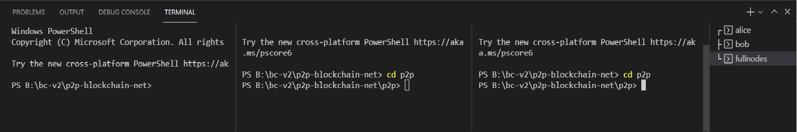

# p2p-blockchain-network

## How to install and run

- Clone this repository.
- install node modules with command:

```
npm install
```

```
cd p2p
npm install
```

- Create three terminals:



main path:

- ```
      node fullnodes.js 4001 4002 4003
  ```
  
get inside p2p:

```
cd p2p
```

and run:
- ```
  node wallet.js bob 4002 4001 4003
  ```
- ```
  node wallet.js alice 4003 4001 4002
  ```

## Model 
### Blockchain

```JavaScript
class Blockchain {
  constructor() {
    this.chain = [this.createGenesisBlock()];
    this.difficulty = 3;
    this.pendingTransactions = [];
    this.miningReward = 10;
  }
```
Defines a BlockChain with list of blocks, mine difficulty, pending transactions
and mining reward


### Block

```JavaScript
class Block {
    constructor(timestamp, transactions, previousHash = '') {
        this.previousHash = previousHash;
        this.timestamp = timestamp;
        this.transactions = transactions;
        this.nonce = 0;
        this.tree = new MerkleTree(this.transactions.map(tran => tran.calculateHash(), sha256))
        this.hash = this.calculateHash();
    }
```
Each Block contains the hash of the previous block, timestamp, nonce, transactions, **a MerkleTree that holds the transactions headers
to futurly improve access for finding an existing transaction.**


### Transaction

```JavaScript
 class Transaction {
    constructor(fromAddress, toAddress, amount, signature, timestamp, tip) {
      this.fromAddress = fromAddress;
      this.toAddress = toAddress;
      this.amount = amount;
      this.signature = signature;
      this.timestamp = timestamp?timestamp:Date.now();
      this.tip = tip;
    }
```

## Main flow

### Fullnodes:
```JavaScript
var t = topology(myIp, peerIps).on("connection", (socket, peerIp) => { // initiate a connection with peers list when  
  const peerPort = extractPortFromIp(peerIp);                          // someone connected.
  log("connected to peer - ", peerPort); 

  socket.on("data", (data) => { // Listens to data that goes through the network.
    if (data.includes("fromAddress")) { // check if data is a transaction.
      var tempTx = JSON.parse(data.toString()); // parse data.
      const newTransaction = new Transaction( // create a transaction from recieved data.
        tempTx.fromAddress,
        tempTx.toAddress,
        tempTx.amount,
        tempTx.signature,
        tempTx.timestamp,
        tempTx.tip
      );
      newCoin.addTransaction(newTransaction) // validate transaction signature, sender balance and add it to chain if valid.
      if (newCoin.pendingTransactions.length === 3) { // check if chain is ready to mine block.
        newCoin.minePendingTransaction(pubK); // mine block. 
      }
    }

        if (data.includes("balance") && newCoin.pendingTransactions.length === 0) { // check if data is balance request.
      log("pending : ", newCoin.pendingTransactions)                                // print all kind of balances.
      log("bob has ", newCoin.getBalanceOfAddress(pkMap.get('bob')))
      log("alice has ", newCoin.getBalanceOfAddress(pkMap.get('alice')))
      log("miner has ", newCoin.getBalanceOfAddress(pubK))
      log("Total mined coins: ", newCoin.getTotalMinedCoins())
      log("Total burned coins: ", newCoin.getTotalBurnedCoins())
      log("Total coins in network: ", newCoin.getCoinsInNetwork())
      exit(0)
    }
    if (data.includes("check")){ // check if data is check request.
      log(data)
      var hashToCheck = String(data).split(' ')
      var flag = newCoin.isTransactionExist(hashToCheck[1]) // validate transaction in block using merkle tree.
      socket.write(`${flag}`) // send back result.
    }
  });
});
```

### Wallet

```JavaScript
var t = topology(myIp, peerIps).on("connection", (socket, peerIp) => {
    const peerPort = extractPortFromIp(peerIp);
    log("connected to peer - ", peerPort);
    var hashToCheck;
    const sendSingleTransaction = (socket) => {
        if (transactions.transactions[index] !== undefined) { // make sure file is not empty
            if (transactions.transactions[index].fromAddress === name) { // make sure to send only self transactions
                let key = ec.keyFromPrivate(prMap.get(name), "hex");
                const tx = new Transaction( // creates new transaction object
                    pkMap.get(name),
                    pkMap.get(name === "alice" ? "bob" : "alice"),
                    transactions.transactions[index].amount,
                    undefined,
                    undefined,
                    transactions.transactions[index].tip ? 1 : 0
                );
                tx.signTransaction(key);
                var buf = Buffer.from(JSON.stringify(tx));
                console.log(tx);
                hashToCheck = tx.calculateHash(); // collecting hash for future check.
                socket.write(buf); // sending signed transaction.
            }
            index++;
            
        } else { // finsh sending transactions
            if (name === "bob") { // only bob send
                setTimeout(() => socket.write(`check ${hashToCheck}`), 3000) 
                setTimeout(() => socket.write("balance"), 6000)
            }
        }
    };
    if ((name === "bob") && first) {  // setting timout for bob to handle send time
        setTimeout(() => setInterval(() => sendSingleTransaction(socket), 3000), 12200);
        first = false;
    } else
        setInterval(() => sendSingleTransaction(socket), 3000);

    socket.on('data', data => log(data.toString('utf8'))) // print data received
});
```


### _Interesting Functions:_

Add a new transaction to the list of pending transactions (to be added
next time the mining process starts). This verifies that the given
transaction is properly signed.

- **Mine Pending Blocks (BlockChain)**

```JavaScript
    minePendingTransaction(miningRewardAddress) {
    const totalTips = this.sumAllTips(this.pendingTransactions);
    const rewardTx = new Transaction( // create a new reward transaction with reward and tip.
      null,
      miningRewardAddress,
      this.miningReward + totalTips, undefined, undefined, 0
    );
    this.pendingTransactions.push(rewardTx); // add reward transaction to pending list.
    let block = new Block(
      Date.now(),
      this.pendingTransactions,
      this.getLatestBlock().hash
    );
    block.mineBlock(this.difficulty);  // mine the prepeard block with chain difficulty.
    console.log("block successfully mined");
    this.chain.push(block);
    this.pendingTransactions = []; //clear pending transaction list.
  }
```

Takes all the pending transactions, puts them in a Block and starts the
mining process. It also adds a transaction to send the mining reward to
the given address.

- **Add Transaction (BlockChain)**

```JavaScript
addTransaction(transaction) {
    if (!transaction.fromAddress || !transaction.toAddress) {
      throw new Error("Transaction must include from and to address");
    }

    // verify the transactiion.
    if (!transaction.isValid(transaction.fromAddress)) {
      throw new Error("Cannot add invalid transaction to chain");
    }

    if (transaction.amount <= 0) {
      throw new Error("Transaction amount should be higher than 0");
    }

    // Making sure that the amount sent is not greater than existing balance.
    if (
      this.getBalanceOfAddress(transaction.fromAddress) < transaction.amount
    ) {
      throw new Error("Not enough balance");
    }

    this.pendingTransactions.push(transaction);
    console.log("transaction added to pending list!");
  }
```

Add a new transaction to the list of pending transactions (to be added
next time the mining process starts). This verifies that the given
transaction is properly signed.

- **Get Balance Of Address (BlockChain)**

```JavaScript
getBalanceOfAddress(address) {
    let balance = 100; //every wallet starts with 100 coins
    for (const block of this.chain) {
      for (const trans of block.transactions) {
        if (trans.fromAddress === address) {   // checks for every transaction in chain.
          balance -= Number(trans.amount) + trans.tip + this.chain.indexOf(block); //reduce amount sent include tip and burn.
          console.log("new balance is after reduction", balance);
        }
        if (trans.toAddress === address) {
          balance += Number(trans.amount); // add the amount sent from others.
        }
      }
    }
    console.log("total balance is after ", balance);
    return balance;
  }
```

- **Get Total Mined Coins (BlockChain)**

```JavaScript
  getTotalMinedCoins() {
    var sum = 0;
    for (const block of this.chain) {
      for (const trans of block.transactions) {
        console.log(`amount is : ${Number(trans.amount)} , tip is : ${trans.tip}`)
        sum += Number(trans.amount);
      }
    }
    return sum;
  }

```
Return the sum of all transactions amount and tip in chain.

- **Sign Transaction (Transaction)**

**Params:**
 _*keyPair*_ of the Signer
```JavaScript
signTransaction(keyPair) {
      // You can only send a transaction from the wallet that is linked to your
      // key. So here we check if the fromAddress matches your publicKey
      if (keyPair.getPublic("hex") !== this.fromAddress) {
        throw new Error('You cannot sign transactions for other wallets!');
      }
      const hashTx = this.calculateHash();
      const sign = keyPair.sign(hashTx).toDER("hex");
      this.signature = sign;
    }
```
Validate signer is signing for himself and then calculate transaction hash and sign
it with his private key.

- **Is Transaction Valid (Transaction)**
```JavaScript

    isValid(publicKey) {
      // If the transaction doesn't have a from address we assume it's a
      // mining reward and that it's valid. You could verify this in a
      // different way (special field for instance)
      if (this.fromAddress === null) return true;
      // Transaction must be signed
      if (!this.signature || this.signature.length === 0) {
        throw new Error('No signature in this transaction');
      }
      var key = ec.keyFromPublic(publicKey, 'hex'); // genereate keyPair object from recieved address
      var isVerified = key.verify(this.calculateHash(), this.signature) // verifies signature with generated key
      return isVerified 
    }
```
Checks if the signature is valid (transaction has not been tampered with).
It uses the _fromAddress_ as the public key.

- Is Transaction Exist
```JavaScript
  isTransactionExist(hash) {
    for (const block of this.chain) { 
      const proof = block.tree.getProof(hash); //get proof with transaction hash (leaf)
      let isExist = block.tree.verify(proof, hash, block.tree.getHexRoot()); //verify existance with proof
      if (isExist) return true;
    }
    return false;
  }
```